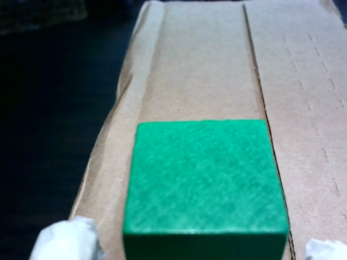
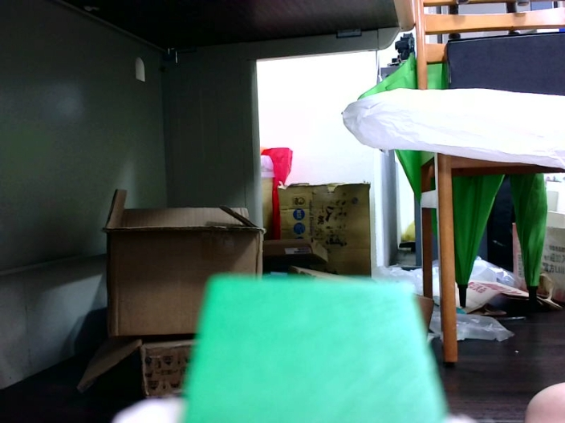
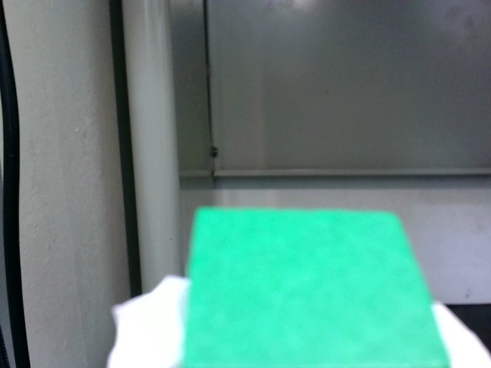
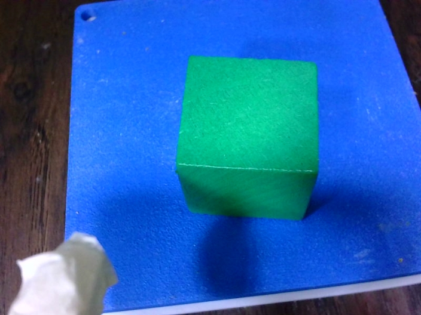

<!--
 * @Author: hibana2077 hibana2077@gmail.com
 * @Date: 2024-06-14 22:17:09
 * @LastEditors: hibana2077 hibana2077@gmail.com
 * @LastEditTime: 2024-06-15 00:46:34
 * @FilePath: \llm-robotic-control\docs\green_box_exp\README.md
 * @Description: 这是默认设置,请设置`customMade`, 打开koroFileHeader查看配置 进行设置: https://github.com/OBKoro1/koro1FileHeader/wiki/%E9%85%8D%E7%BD%AE
-->
# 說明 (移動綠色方塊)

1. 對準

白白的是手臂的防滑墊

2. 抓取

3. 移動

4. 放下

