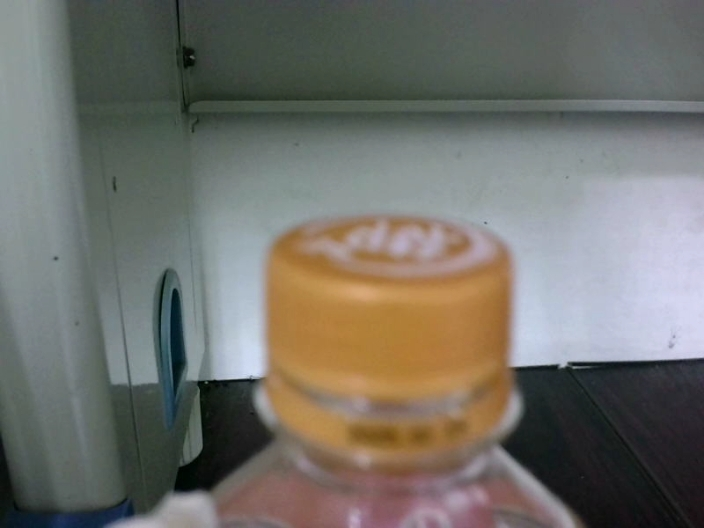

<!--
 * @Author: hibana2077 hibana2077@gmail.com
 * @Date: 2024-06-14 19:39:23
 * @LastEditors: hibana2077 hibana2077@gmail.com
 * @LastEditTime: 2024-06-14 19:52:00
 * @FilePath: \llm-robotic-control\docs\plastic_bottle_exp\README.md
 * @Description: 这是默认设置,请设置`customMade`, 打开koroFileHeader查看配置 进行设置: https://github.com/OBKoro1/koro1FileHeader/wiki/%E9%85%8D%E7%BD%AE
-->
# 說明

這裡的照片都是手臂上的攝影機所拍攝的，為了方便觀看，我們將照片按照操作步驟進行排序。

1. 對準塑膠瓶

2. 對準塑膠瓶 - 2

3. 抓取塑膠瓶

4. 轉動機械手臂

5. 放置塑膠瓶

6. 後退 檢查

